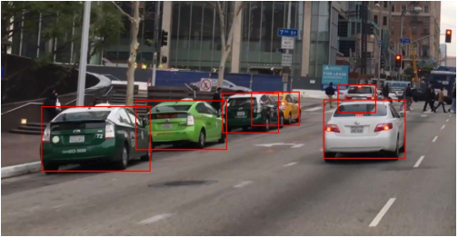
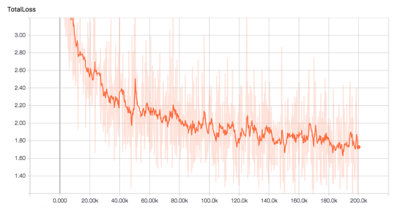
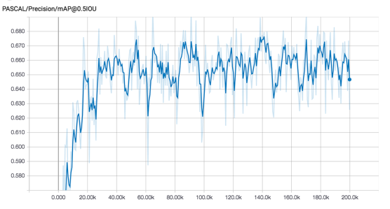
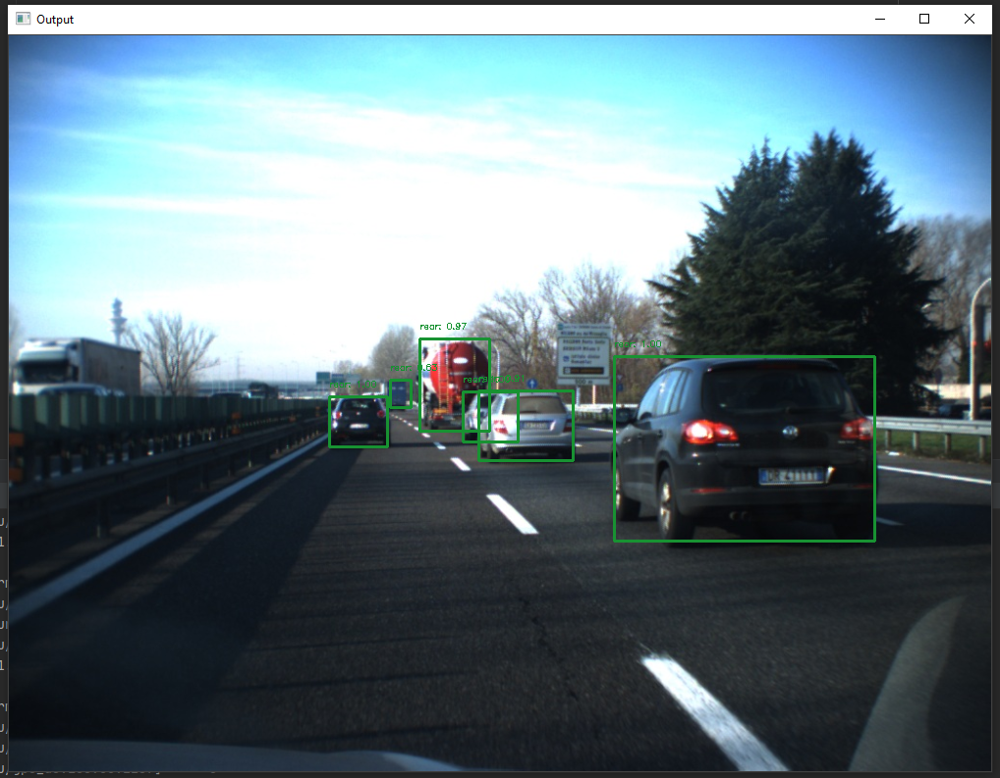
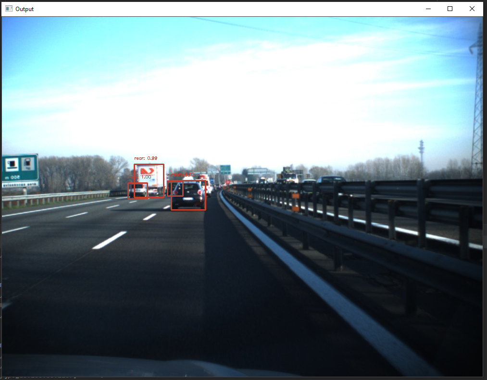
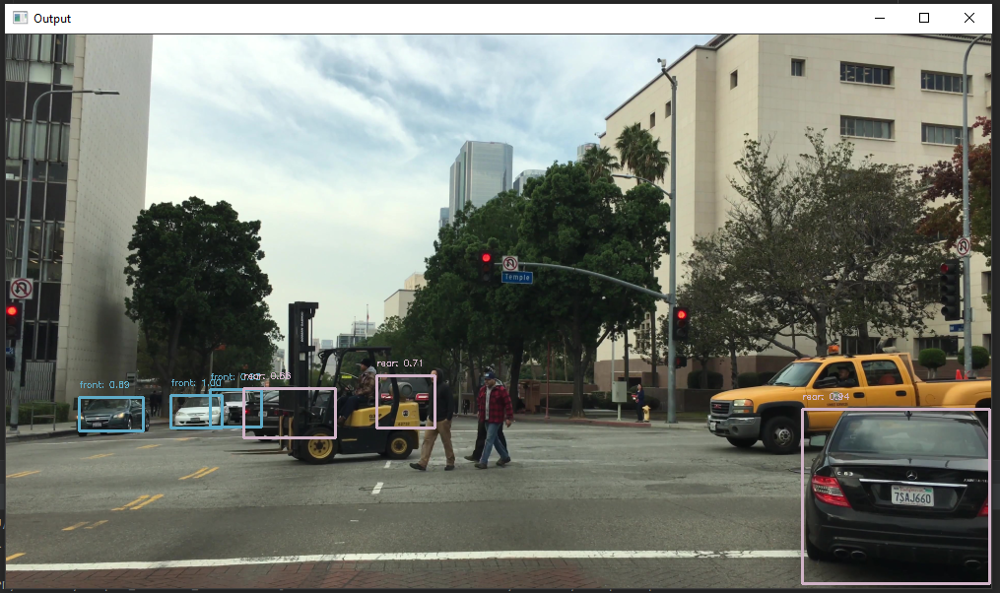

# Single Shot Detector on Vehicle Dataset

## Problem
* Given Deep learning problem for self-driving cars by training a Single Shot Detector (SSD) to recognize both the front and rear views of vehicles using a vehicle dataset curated and labeled by Davis King of dlib.
* Each image in this dataset was captured from a camera mounted to a car’s dashboard. For each image, all visible front and rear views of vehicles are labeled as the image below.
* Given the dlib vehicel dataset (the dataset can be downloaded from here 
[link](http://dlib.net/files/data/)). The task is to use SSD to detect and localize front and rear of cars

    

## Built With
* Python
* Tensorflow Object Detection API (TFOD API)
* Google Colab

## Approach
* The vehicles dataset was labeled by XML file so first we need to extract the class labels by using BeautifulSoup library
* Then convert all images and its labels to tensorflow record file 
* Use pre-trained model in this project I used SSD inception v1 for tf 1.x in order to use this step we need to clone the TFOD API the link can be found [here](https://github.com/tensorflow/models)

Training process over 200,000 steps, which took approximately 13 hours on Google Colab. The loss ended at approximately 1.7

## Visualize the loss and accuracy in TensorBoard

## Result

